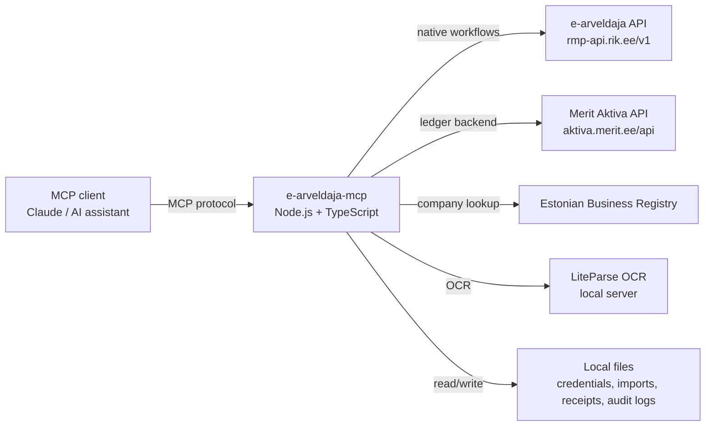
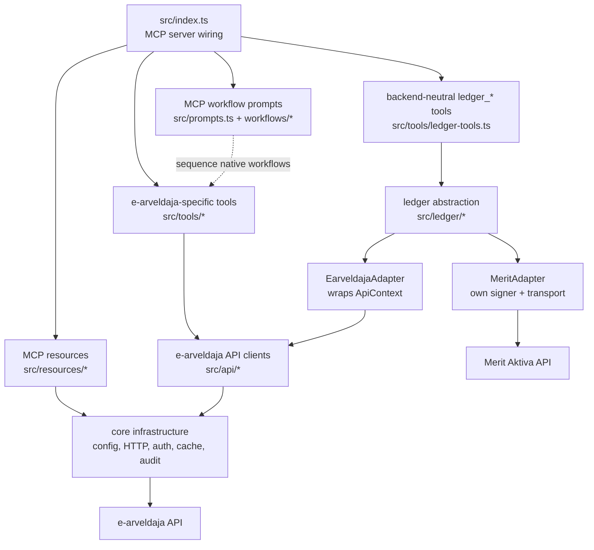
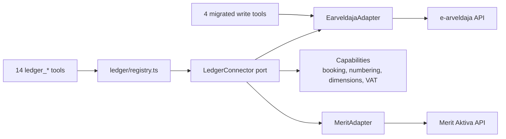

# Architecture

This document uses small, purpose-specific diagrams. The diagrams show stable
relationships; exact file lists, safety rules, and backend differences live in
tables and bullets because those are easier to read, maintain, and reuse in
future AI sessions.

## System context

## Internal runtime shape

## Module map

| Area | Main files | Role |
|---|---|---|
| MCP wiring | `src/index.ts` | Registers tools, prompts, resources, startup instructions, and session mode |
| MCP workflow prompts | `src/prompts.ts`, `src/workflow-prompt-source.ts`, `workflows/*` | Client-facing business-intent runbooks; many intents are backend-neutral, but today's recipes mostly call e-arveldaja-native tools |
| Native e-arveldaja tools | `src/tools/*` | Domain workflows for invoices, bank, CAMT, OCR, tax, reporting, attachments, and inboxes |
| Backend-neutral ledger tools | `src/tools/ledger-tools.ts` | `ledger_*` tool surface over the `LedgerConnector` port |
| MCP resources | `src/resources/*` | Read-only static and dynamic accounting context |
| e-arveldaja API clients | `src/api/*` | Resource-specific REST wrappers, CRUD helpers, and pagination |
| Ledger abstraction | `src/ledger/*` | Canonical types, connector port, registry, e-arveldaja adapter, Merit adapter |
| Core infrastructure | `src/config.ts`, `src/http-client.ts`, `src/auth.ts`, `src/cache.ts`, `src/audit-log.ts` | Credential loading, transport, signing, cache invalidation, and mutation audit trail |
| MCP-safe output | `src/mcp-json.ts`, `src/tool-response.ts` | JSON text responses and untrusted-text sandboxing |
| Local files | `apikey*.txt`, imports, receipts, `logs/*.audit.md` | Credentials and accounting inputs stay local; mutation history is append-only |

## Agent orientation

- Do not assume e-arveldaja is the only accounting backend.
- Most native tools are e-arveldaja-specific; `src/ledger/` is the backend-neutral surface.
- Treat workflow prompt names as business intents, not proof of backend portability. Read the workflow source to see whether the current recipe calls native tools or `ledger_*`.
- Three recipes are backend-aware (`book-invoice`, `new-supplier`, `company-overview`): each opens with a Step 0 that routes to a ledger branch on non-e-arveldaja backends, and in a ledger session these prompts serve their runbook instead of the setup-mode text. The rest declare **Backend: e-arveldaja only** up front and must not be improvised onto other backends with `ledger_*` tools.
- New cross-backend workflows should follow the same pattern: start with `list_ledger_backends` and respect connector `capabilities`.
- New cross-backend accounting behaviour should prefer the `LedgerConnector` port when the capability belongs in more than one backend.
- Each ledger connector declares its real `capabilities`; callers should discover support instead of assuming hidden parity.
- Mutating workflows must preserve dry-run defaults, explicit approval, audit logging, path validation, and untrusted-text sandboxing.
- Inter-account transfer confirmation goes through `reconcile_inter_account_transfers`; do not hand-roll direct confirmations that can duplicate journals.

## Prompt taxonomy

MCP prompts are runbooks returned to the client. Their slugs usually describe
what the user wants to accomplish; the Markdown body describes the current
backend recipe.

| Prompt group | Prompts | Intent | Current recipe |
|---|---|---|---|
| Setup | `setup-credentials`, `setup-e-arveldaja` | Configure API access | e-arveldaja-specific |
| Inbox and review orchestration | `accounting-inbox`, `resolve-accounting-review`, `prepare-accounting-review-action` | Triage accounting inputs and review items | Native workflow tools such as `accounting_inbox` and `continue_accounting_workflow` |
| Purchase and supplier entry | `book-invoice`, `receipt-batch`, `new-supplier` | Universal bookkeeping intents: enter supplier, receipt, and purchase invoice data safely | `book-invoice` and `new-supplier` are backend-aware (Step 0 routes to `ledger_*` on non-e-arveldaja backends; local OCR still applies); `receipt-batch` is e-arveldaja-only |
| Bank import and reconciliation | `import-camt`, `import-wise`, `classify-unmatched`, `reconcile-bank` | Mostly universal cash-management intents, with CAMT/Wise source-specific input handling | Native e-arveldaja bank transaction, account-dimension, PROJECT, confirmation, and inter-account-transfer tools |
| Reporting and close | `company-overview`, `month-end-close` | Universal reporting and period-close intents | `company-overview` is backend-aware (lighter `ledger_list_*` overview on other backends; port reporting is declared but not exposed as tools yet); `month-end-close` is e-arveldaja-only |
| Investment booking | `lightyear-booking` | Source-specific investment accounting workflow | Native journal/import helpers with explicit account numbers and dimensions |

For new prompts, keep the user-facing intent stable and put backend dependence
in the recipe. A backend-aware recipe should begin by discovering backends and
capabilities, then choose either a `ledger_*` path or a clearly named native
e-arveldaja path. Do not silently route a native-only recipe to another backend.

## Ledger abstraction layer (`src/ledger/`)

An optional intermediate ports-and-adapters layer that lets the same server
drive **other bookkeeping backends** through one canonical model. The
existing e-arveldaja tools and API clients remain the native, full-power
surface; the ledger layer sits beside them as the cross-backend surface. The
e-arveldaja adapter wraps the existing `ApiContext`, so it reuses the
`HttpClient`, cache, auth, and audit machinery above unchanged. The Merit
adapter brings its **own** HMAC-SHA256 signer and a minimal POST-with-body
transport (60s timeout, ~1 req/s pacing for Merit's per-key throttle, and one
retry — any endpoint on 429, idempotent `get*` endpoints on network errors;
no shared cache). The mutating `ledger_*` tools write the same session audit
log as every other mutating tool; writes against a non-e-arveldaja backend go
to that backend's own file (`logs/merit.audit.md`) so they are never
attributed to an e-arveldaja company.

The **booking boundary** is the key abstraction: the canonical `JournalEntry`
carries balanced `Posting[]`, and each adapter decides how to land it —
e-arveldaja registers explicit postings and walks `draft → confirmed → void`,
while Merit pushes a document and lets the backend post (so `confirm()` is a
no-op). Backend asymmetries (numbering, ref format, dimension model, VAT scope,
source-document requirement, query-span limits, feature flags) are declared in
`Capabilities` and surfaced by `list_ledger_backends`, so callers discover what
a backend supports instead of the adapter silently faking it.

| File | Role |
|---|---|
| `ledger/types.ts` | Canonical model (Money, Ref, Party, Invoice, Payment, JournalEntry, …) |
| `ledger/port.ts` | `LedgerConnector` interface + `Capabilities` + feature mixins |
| `ledger/result.ts` | `Result` envelope; maps thrown `HttpError` → `LedgerError` |
| `ledger/registry.ts` | Builds configured backends, resolves the default, reports credential state |
| `ledger/earveldaja/adapter.ts` | Wraps the existing `ApiContext` (explicit booking) |
| `ledger/merit/{signer,http,config,adapter}.ts` | Merit Aktiva (auto-post booking) |
| `tools/ledger-tools.ts` | The 14 `ledger_*` MCP tools over the port |

**Tool surface.** Fourteen backend-neutral `ledger_*` tools take a `backend`
argument: discovery (`list_ledger_backends` — call it first), six reads
(`ledger_list_accounts`, `ledger_list_tax_rates`, `ledger_list_parties`,
`ledger_list_items`, `ledger_list_sales_invoices`,
`ledger_list_purchase_invoices`), five writes (`ledger_upsert_party`,
`ledger_create_sales_invoice`, `ledger_create_purchase_invoice`,
`ledger_record_payment`, `ledger_post_journal`), and two lifecycle
transitions (`ledger_confirm`, `ledger_void` — on an auto-post backend like
Merit, confirm reports the steady state and void deletes; on e-arveldaja they
register / invalidate). Four existing e-arveldaja write tools
(`create_sale_invoice`, `create_purchase_invoice`, `create_journal`,
`confirm_transaction`) also route through the `EarveldajaAdapter`, with
unchanged public behaviour.

**Configuration & backend selection.** Merit is registered only when
`MERIT_API_ID` / `MERIT_API_KEY` (and optional `MERIT_API_COUNTRY=EE|PL`) are
set; otherwise only e-arveldaja is available. The default backend for
unqualified `ledger_*` calls resolves in order: (1)
`EARVELDAJA_LEDGER_DEFAULT_BACKEND` if it names a registered backend, (2)
e-arveldaja if it has credentials, (3) the first other configured backend,
(4) e-arveldaja as a last resort. `list_ledger_backends` reports each
backend's *real* credential state — when the server runs without e-arveldaja
credentials, e-arveldaja is listed as unconfigured with a setup-mode note.

**Ledger session (running without e-arveldaja).** When e-arveldaja has no
credentials but a ledger backend (e.g. Merit) is configured, the server boots
as a **ledger session** (`ledgerOnlySession` in `index.ts`): the startup
banner and the MCP server instructions present the configured backend as
available and the `ledger_*` tools as the working surface, that backend
becomes the default, and the ~133 e-arveldaja-specific tools stay in setup
mode until credentials are added.

**Declared in the port but not yet exposed as tools (follow-ups):**
`trialBalance` / `incomeStatement` (both adapters currently return
`unsupported`; e-arveldaja has native reporting tools), Merit's
`deliverByEInvoice` / `deliverByEmail` mixin methods, and the `native()`
escape hatch.
