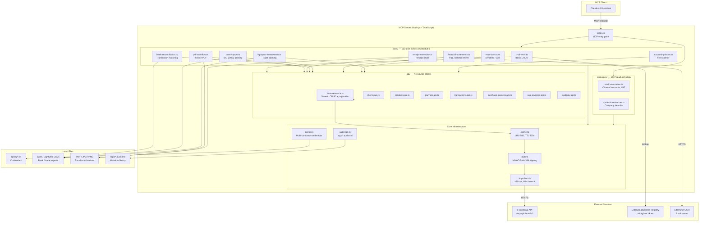
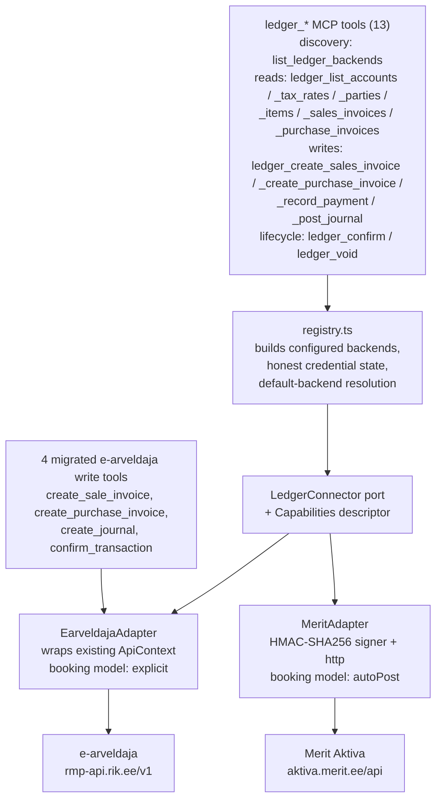

# Architecture Diagram

## Layer Summary

| Layer | Role |
|---|---|
| **Tools** | Domain logic — invoices, bank, tax, OCR, reporting |
| **API clients** | Resource-specific REST wrappers (CRUD + pagination) |
| **Cache** | In-memory LRU, auto-invalidated on mutations |
| **Auth** | Signs every request with HMAC-SHA-384 |
| **HTTP client** | Rate-limited, timeout-guarded outbound calls |
| **Config** | Multi-company credential loading & switching |
| **Audit log** | Append-only markdown log of all mutations |

## Ledger abstraction layer (`src/ledger/`)

An optional intermediate ports-and-adapters layer that lets the same server
drive **other bookkeeping backends** through one canonical model. The
existing 12 modules / api clients above remain the native, full-power
e-arveldaja surface; the ledger layer sits beside them as the cross-backend
surface. The e-arveldaja adapter wraps the existing `ApiContext`, so it reuses
the `HttpClient`, cache, auth, and audit machinery above unchanged; the Merit
adapter brings its **own** HMAC-SHA256 signer and a minimal POST-with-body
transport (60s timeout; no shared cache, rate limiter, or retry yet — see
Follow-ups below).

The **booking seam** is the key abstraction: the canonical `JournalEntry`
carries balanced `Posting[]`, and each adapter decides how to land it —
e-arveldaja registers explicit postings and walks `draft → confirmed → void`,
while Merit pushes a document and lets the backend post (so `confirm()` is a
no-op). Backend asymmetries (numbering, ref format, dimension model, VAT scope,
source-document requirement, query-span limits, feature flags) are declared in
`Capabilities` and surfaced by `list_ledger_backends`, so callers discover what
a backend supports instead of the adapter silently faking it.

| File | Role |
|---|---|
| `ledger/types.ts` | Canonical model (Money, Ref, Party, Invoice, Payment, JournalEntry, …) |
| `ledger/port.ts` | `LedgerConnector` interface + `Capabilities` + feature mixins |
| `ledger/result.ts` | `Result` envelope; maps thrown `HttpError` → `LedgerError` |
| `ledger/registry.ts` | Builds configured backends, resolves the default, reports credential state |
| `ledger/earveldaja/adapter.ts` | Wraps the existing `ApiContext` (explicit booking) |
| `ledger/merit/{signer,http,config,adapter}.ts` | Merit Aktiva (auto-post booking) |
| `tools/ledger-tools.ts` | The 13 `ledger_*` MCP tools over the port |

**Tool surface.** Thirteen backend-neutral `ledger_*` tools take a `backend`
argument: discovery (`list_ledger_backends` — call it first), six reads
(`ledger_list_accounts`, `ledger_list_tax_rates`, `ledger_list_parties`,
`ledger_list_items`, `ledger_list_sales_invoices`,
`ledger_list_purchase_invoices`), four writes (`ledger_create_sales_invoice`,
`ledger_create_purchase_invoice`, `ledger_record_payment`,
`ledger_post_journal`), and two lifecycle transitions (`ledger_confirm`,
`ledger_void` — on an auto-post backend like Merit, confirm reports the steady
state and void deletes; on e-arveldaja they register / invalidate). Four
existing e-arveldaja write tools (`create_sale_invoice`,
`create_purchase_invoice`, `create_journal`, `confirm_transaction`) also route
through the `EarveldajaAdapter`, with unchanged public behaviour.

**Configuration & backend selection.** Merit is registered only when
`MERIT_API_ID` / `MERIT_API_KEY` (and optional `MERIT_API_COUNTRY=EE|PL`) are
set; otherwise only e-arveldaja is available. The default backend for
unqualified `ledger_*` calls resolves in order: (1)
`EARVELDAJA_LEDGER_DEFAULT_BACKEND` if it names a registered backend, (2)
e-arveldaja if it has credentials, (3) the first other configured backend,
(4) e-arveldaja as a last resort. `list_ledger_backends` reports each
backend's *real* credential state — when the server runs without e-arveldaja
credentials, e-arveldaja is listed as unconfigured with a setup-mode note.

**Ledger session (running without e-arveldaja).** When e-arveldaja has no
credentials but a ledger backend (e.g. Merit) is configured, the server boots
as a **ledger session** (`ledgerOnlySession` in `index.ts`): the startup
banner and the MCP server instructions present the configured backend as
available and the `ledger_*` tools as the working surface, that backend
becomes the default, and the ~133 e-arveldaja-specific tools stay in setup
mode until credentials are added.

**Declared in the port but not yet exposed as tools (follow-ups):**
`upsertParty` (implemented by both adapters), `trialBalance` /
`incomeStatement` (both adapters currently return `unsupported`; e-arveldaja
has native reporting tools), Merit's `deliverByEInvoice` / `deliverByEmail`
mixin methods, and the `native()` escape hatch. Two known hardening gaps:
the mutating `ledger_*` tools do not yet write the session audit log (the
four migrated e-arveldaja write tools kept their tool-level audit entries),
and the Merit transport has no rate limiting or retry.
