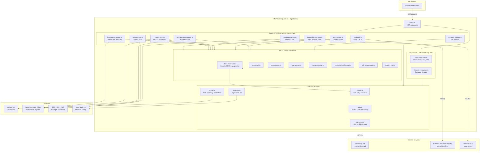
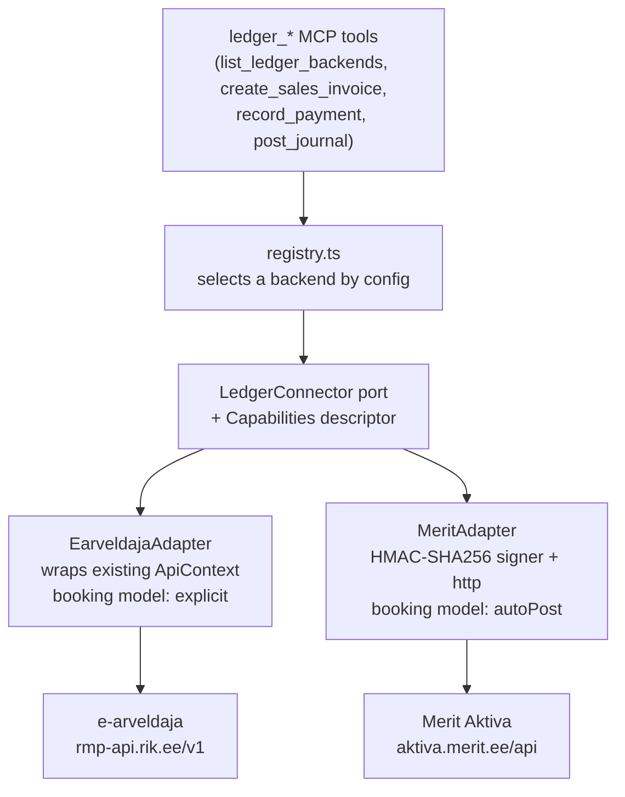

# Architecture Diagram

## Layer Summary

| Layer | Role |
|---|---|
| **Tools** | Domain logic — invoices, bank, tax, OCR, reporting |
| **API clients** | Resource-specific REST wrappers (CRUD + pagination) |
| **Cache** | In-memory LRU, auto-invalidated on mutations |
| **Auth** | Signs every request with HMAC-SHA-384 |
| **HTTP client** | Rate-limited, timeout-guarded outbound calls |
| **Config** | Multi-company credential loading & switching |
| **Audit log** | Append-only markdown log of all mutations |

## Ledger abstraction layer (`src/ledger/`)

An optional intermediate ports-and-adapters layer that lets the same server
drive **other Estonian bookkeeping backends** through one canonical model. The
existing 12 modules / api clients above remain the native, full-power
e-arveldaja surface; the ledger layer sits beside them as the cross-backend
surface and reuses the same `HttpClient`, cache, auth, and audit machinery.

The **booking seam** is the key abstraction: the canonical `JournalEntry`
carries balanced `Posting[]`, and each adapter decides how to land it —
e-arveldaja registers explicit postings and walks `draft → confirmed → void`,
while Merit pushes a document and lets the backend post (so `confirm()` is a
no-op). Backend asymmetries (numbering, ref format, dimension model, VAT scope,
source-document requirement, feature flags) are declared in `Capabilities` and
surfaced by `list_ledger_backends`, so callers discover what a backend supports
instead of the adapter silently faking it.

| File | Role |
|---|---|
| `ledger/types.ts` | Canonical model (Money, Ref, Party, Invoice, Payment, JournalEntry, …) |
| `ledger/port.ts` | `LedgerConnector` interface + `Capabilities` + feature mixins |
| `ledger/result.ts` | `Result` envelope; maps thrown `HttpError` → `LedgerError` |
| `ledger/registry.ts` | Builds/selects configured backends |
| `ledger/earveldaja/adapter.ts` | Wraps the existing `ApiContext` (explicit booking) |
| `ledger/merit/{signer,http,config,adapter}.ts` | Merit Aktiva (auto-post booking) |

**Configuration.** Merit is registered only when `MERIT_API_ID` /
`MERIT_API_KEY` (and optional `MERIT_API_COUNTRY=EE|PL`) are set; otherwise only
e-arveldaja is available. `EARVELDAJA_LEDGER_DEFAULT_BACKEND` chooses the
default target for the `ledger_*` tools.
